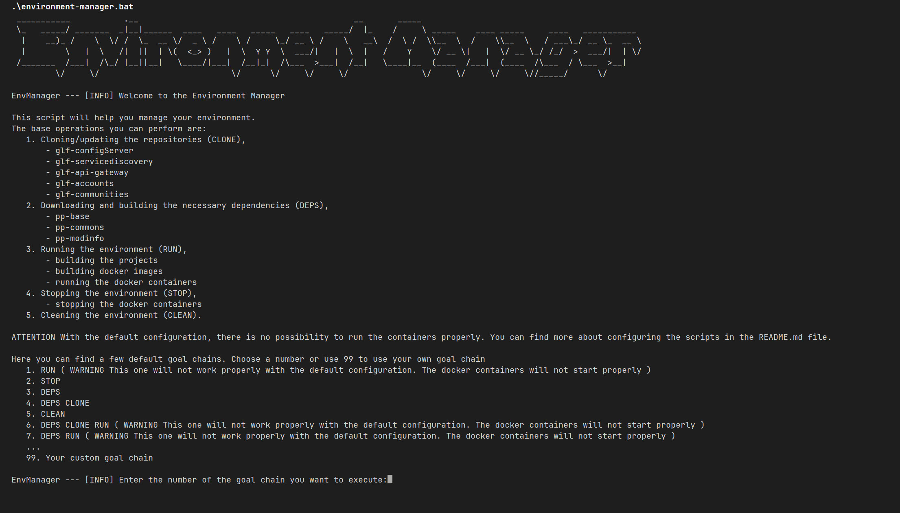
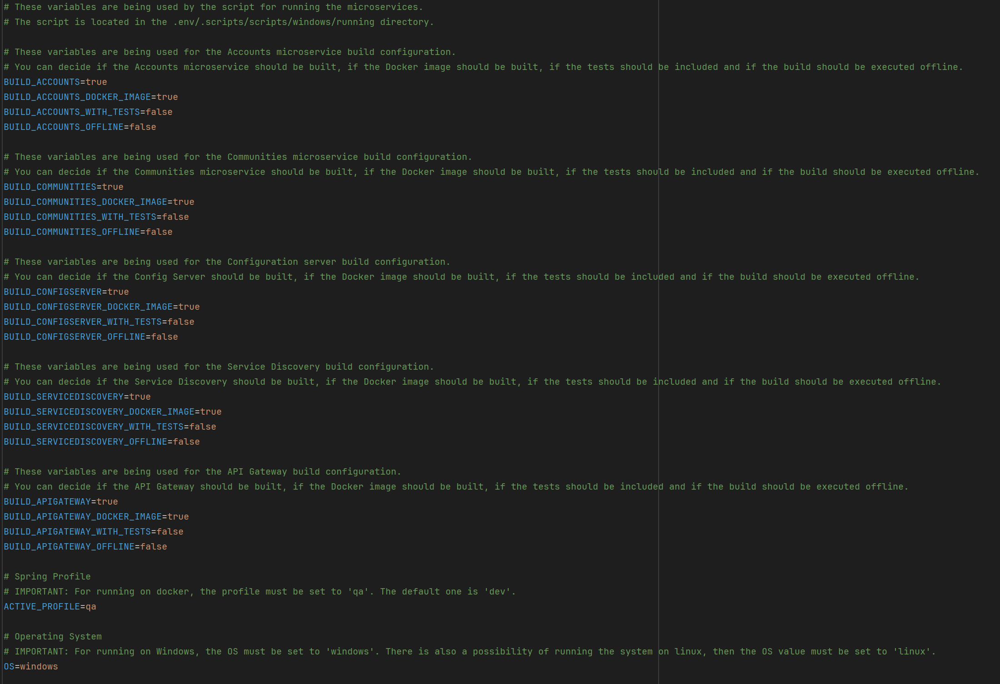
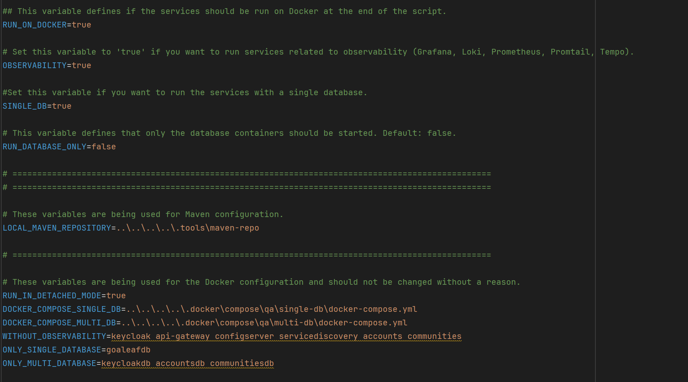
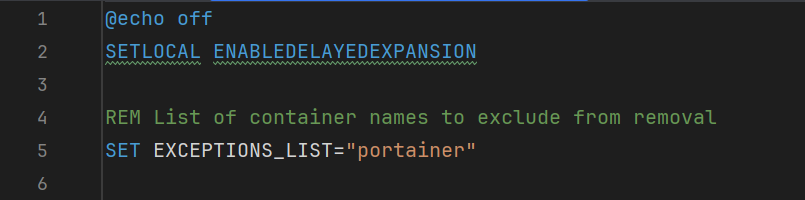

# Goaleaf Server - README

---

## Table of Contents

- [Introduction](#introduction)
- [Requirements](#requirements)
- [The project structure](#the-project-structure)
- [Environment setup](#environment-setup)
- [Using the environment manager](#using-the-environment-manager)
- [Configuration](#configuration)
- [Secrets](#secrets)

---

## Introduction

This is the server-side application for the Goaleaf project. It is a RESTful API that provides endpoints for the client-side application to interact with the database. The server is built using Java and the Spring Boot framework.

This specific repository is the main directory of the working environment. Here you can find scripts and configurations necessary for running the server and managing the development environment.

---

## Requirements

- Java 17 or higher
- Maven 3.8.1 or higher
- Docker (optional for testing or running databases)

---

## The project structure

The project is divided into several modules (separated microservices), each with its own responsibilities. Here is a brief overview of the modules:

- **glf-configServer**: A service responsible for managing the configuration of the other services,
- **glf-serviceDiscovery**: A service responsible for managing the service discovery and registration,
- **glf-gateway**: A service responsible for managing the API gateway,
- **glf-accounts**: A service responsible for managing user accounts and the data related,
- **glf-communities**: A service responsible for managing communities including members, tasks, posts, boards, points and many, many more.

The project also uses external local services:

- **keycloak**: An identity and access management service,
- **mysql**: A relational database for storing data,
- **rabbitmq**: A message broker for asynchronous communication between services.

Observability tools are also included:

- **promtail**: An agent that collects logs and sends them to Loki,
- **loki**: A log aggregation system,
- **tempo**: A distributed tracing system,
- **prometheus**: A monitoring system that collects metrics from the services,
- **grafana**: A visualization tool for monitoring and analyzing data.

---

## Environment setup

In the main directory you can find a batch script which will help you manage the environment.

**Environment manager** lets you execute a few commands that will help you manage the environment:

### **CLONE**
Clones the repositories of the microservices to the working directory.

### **DEPS**
Installs the dependencies necessary for the microservices.
Specifically it downloads the repositories and installs the artifacts in the local maven repository.
The default local maven repository is located in the `.tools/maven-repo` directory. It can be modified in the configuration **.env** file (see: [Configuration](#Configuration) section).

### **RUN**
Reads the configuration (see **Configuration** section) and basing on it, executes (or not) a few steps one by one:

- Builds the microservices projects,
- Builds the docker images,
- Runs the docker containers.

### **STOP**
Stops the running docker containers.

### **CLEAN**
Cleans the docker environment. Removes all the docker containers and images ignoring the ones from the exception list (see [Configuration](#Configuration) section).

---

## Using the environment manager

The environment manager executes the goals one by one just like they have been given in the **goal chain**.
The goal chain is just a list of goals separated by a space.

After running the script, you can see there are a few default goal chains available. If you want to run one of them, just type an appropriate number.
There is also a possibility of providing your own goal chain. Just type **99** as the goal chain number and then type your own goal chain.

---

## Configuration

**ATTENTION** Before running the environment manager, you need to know that with the default configuration there is no possibility of running the whole environment on docker properly (see [Secrets](#Secrets) section). Some of the containers will not start without providing some information that should not be made available to public.

The environment manager uses subscripts located in the **.scripts** directory. Each of them is responsible for a specific goal:

- **prepare_dev_environment.bat** - cloning the microservices' repositories,
- **build_pp_libs.bat** - installing dependencies for the microservices,
- **clean_docker_environment.bat** - cleaning the docker environment,
- running\\**setUp.bat** - building the projects, building the docker images, running the docker containers,
- running\\**tearDown.bat** - stopping the docker containers.

The configuration is stored in the running\\**.env** file storing the environment variables. The file is divided into few sections:

These variables are used by the scripts to determine how the microservices projects should be built.
You can modify the build process of each microservice separately here.
You can define if the project should be built at all, if the docker image should be built, if the tests should be run and if the build should be done in the offline mode.

**ATTENTION** The offline mode should not be used if you are building the project for the first time.

**ATTENTION** The offline mode should not be used if you are building the docker images. It will work if you have the dependencies locally, although the docker images will not be built if you do not have the internet access.

You can also define if the docker containers should be run after finishing the script execution, if the observability services should be run and if you want to run all the microservices with the single database.
You can also modify the local maven repository location.

**ATTENTION!** If you want to edit the cleaning script's exception list, you have to do it manually in the **clean_docker_environment.bat** file.
Entries should be separated by a space.

---

## Secrets

Microservices use some secrets that should not be made available to public.
If you want to run the services properly, you need to provide the secrets.

In the **.docker\\compose\\qa** directory you can find a subdirectories for single database run and multi database run.
Each of them contains the **.env-public** file which is a template for the necessary configuration.
Before running the containers, you have to rename the file to **.env** and fill it with the proper values.